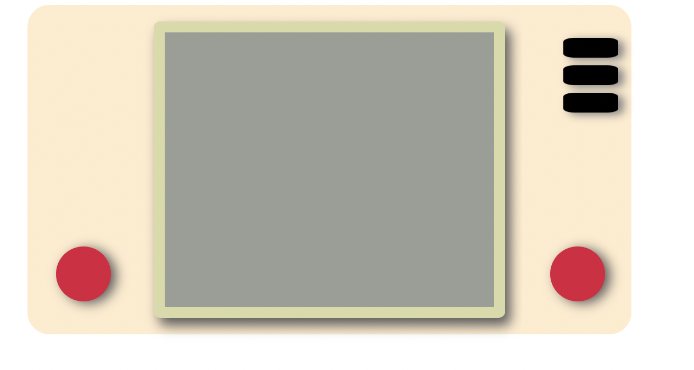

# Consola Nintendo con Css y HTML

## Contenido

- [Saber Más](#about)
- [Instalación](#getting_started)
- [Uso](#usage)

## Saber Más 

Este proyecto trata de aprender a utilizar correctamente el posicionamiento de objetos utilizando la tecnologia Flex, a traves de Html y Css.

## Instalación

No és necesario ningún tipo de instalación previa.

### Vista previa

Html

CSS

Resultado

## Uso 

Pasando el ratón por encima de la pantalla nos aparecerá una imagen, de esta forma, parece que la consola se ha conectado.
